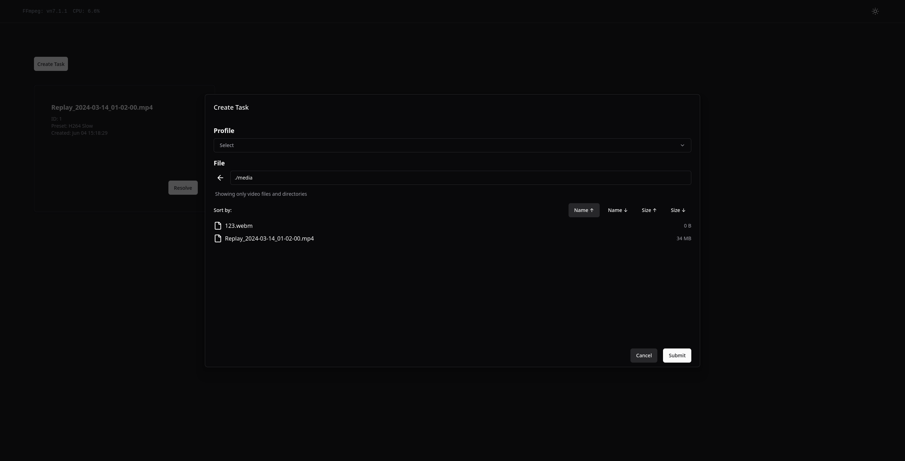
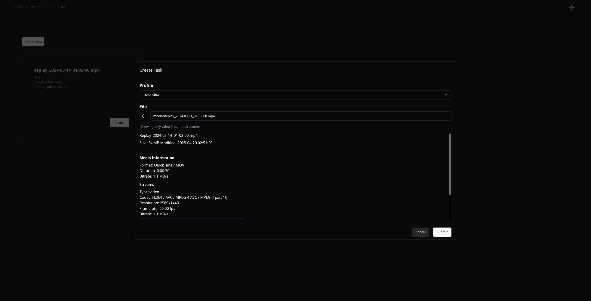
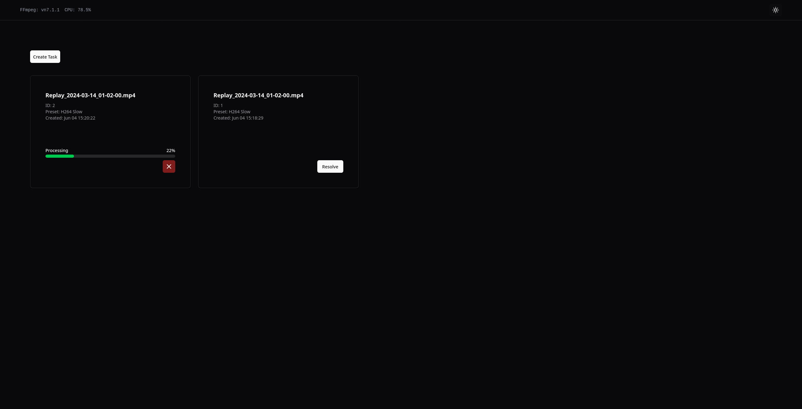
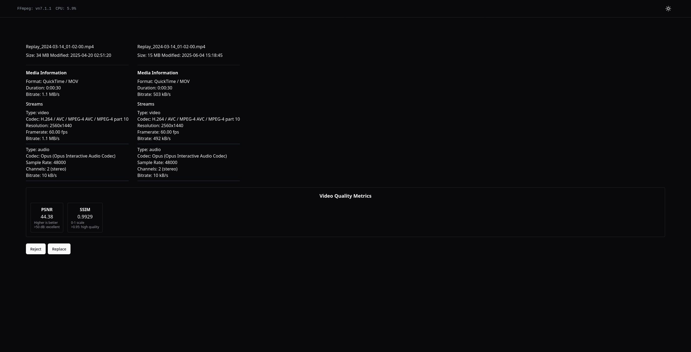

# Easy Transcoder

Easy Transcoder is a self-hosted application that provides a user-friendly interface for video transcoding tasks. It uses FFmpeg to convert video files to different formats and resolutions based on user-defined profiles in the configuration.

## Features

- **Web Interface**: Simple and intuitive UI for managing transcoding tasks
- **Profile System**: Create and use multiple transcoding profiles with customizable FFmpeg parameters
- **Queue Management**: Organize and monitor transcoding jobs with progress tracking
- **File Browser**: Easily select files for transcoding through the built-in file browser
- **Task Resolution**: Choose whether to replace original files or save as new files

## Screenshots

(UI to be improved)

<p align="center">
  
&nbsp; &nbsp; &nbsp;
  
</p>
<p align="center">
  
&nbsp; &nbsp; &nbsp;
  
</p>

## Usage

### Configuration

Create a `config.yaml` file with your transcoding profiles:

```yaml
tempdir: "/path/to/temp/directory" # Temporary directory for in-progress transcodes

profiles:
  - name: "x264-high"
    params:
      c:v: "libx264"
      preset: "slow"
      crf: "18"
      c:a: "aac"
      b:a: "128k"

  - name: "x265-medium"
    params:
      c:v: "libx265"
      preset: "medium"
      crf: "23"
      c:a: "aac"
      b:a: "128k"
```

Each profile contains a name and a map of FFmpeg parameters that will be passed to the transcoder.

### Start Server

```bash
  docker run
    -p 8080:8080
    -v /path/to/media:/media
    -v ./config.yaml:/app/config.yaml
    ghcr.io/royalcat/easy-transcoder:master
```

## Development

## Architecture

- Built in Go with a modern web interface
- Uses FFmpeg for transcoding operations
- Implements a queue-based processing system for handling multiple tasks
- Supports custom transcoding profiles via configuration

### Building from source

```bash
# Clone the repository
git clone https://github.com/royalcat/easy-transcoder.git
cd easy-transcoder

# Regenerate tailwind and templ
make generate
```

### TODO

- [x] Queue
- [x] Profiles
- [x] Task cancel
- [ ] Better resolution UI
- [x] VMAF
- [ ] Browser Notifications
- [x] ffmpeg version check
- [ ] download custom ffmpeg binary
- [x] cpu usage
- [ ] SSE for queue updates
- [ ] task mutiprocessing
- [ ] S3 (probably, using s3fs or similar may be an easier option)
- [ ] Two-pass encoding
- [ ] Dynamic parameters for profiles

### Not planned

This project is focused on simplicity and ease of use, so some features are intentionally not included and will not be implemented in this project:

- Distributed transcoding
- User authentication
- Automation
